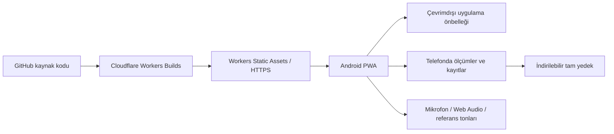

# Ses ve Diksiyon Uygulaması — Geliştirme Planı

Tarih: 1 Ekim 2026 · Hedef: Android telefon · Durum: Planlama, uygulama geliştirmesi başlamadı.

Kaynak: Bu dizindeki 11 sayfalık `ses.pdf`, “Vokal ve Diksiyon Planı: Hafta 0 + 12 Hafta”. PDF'nin bütün sayfaları görsel olarak incelendi. Aşağıda PDF'deki program ile uygulama için önerilen kararlar ayrılmıştır. Bu belge programın klinik olarak doğrulandığı anlamına gelmez.

## 1. Ürün kararı

Türkçe, Android'de ana ekrana kurulabilen, temel eğitimi internet olmadan çalıştıran bir PWA geliştireceğiz. Çalışma adı: **Ses Atölyem**; ad daha sonra değiştirilebilir.

Ana amaç: Uygulamayı açtığında o gün ne yapacağını, nasıl yapacağını ve neyi kaydedeceğini bilmen. Piyano, tuner, sayaç, kayıt cihazı, okuma metni ve günlük aynı uygulamada olacak.

İlk kullanılabilir tam sürüm, Hafta 0 ve 12 haftanın tamamını içerecek. Geliştirmeyi küçük teslimlere ayırmak, yalnızca ilk haftayı sunmak anlamına gelmiyor.

Başlangıç kararları:

- Tek kişilik kullanım; hesap açmak gerekmeyecek.
- Kod GitHub'da paylaşılabilecek; kişisel kayıtlar ve ölçümler kod deposuna girmeyecek.
- Yayın platformu: **Cloudflare Workers + Static Assets**. “Cloudflare workspace” ifadesini bu yayın hedefi olarak yorumluyoruz.
- Ses analizi ve kayıt, ilk sürümde telefonda yapılacak.
- AI kullanımı zorunlu olmayacak; haftalık rapor kopyalama ilk sürümde olacak.
- Tam yedekleme ve geri yükleme ilk sürümün zorunlu özellikleri olacak.

## 2. PDF'den çıkan program

| Dönem | Program | Uygulamadaki karşılığı |
|---|---|---|
| Hafta 0 | 3 gün başlangıç ölçümü | Adım adım kurulum ve başlangıç testi |
| Hafta 1–3 | Temel ses, rahat aralık, yavaş diksiyon | İlk çalışma notaları, tekrarlar, kayıt |
| Hafta 4–6 | Aralık genişletme, arpej, kulak taklidi | Nota dizileri, tuner gizleme, sıçrama ölçümü |
| Hafta 7–9 | P çevresindeki geçiş çalışmaları | Onaylanmış P'ye göre hedefler, kullanıcı değerlendirmesi |
| Hafta 10–12 | Şarkı ve hitabeti birleştirme | Cümle/şarkı çalışması, konuşma kayıtları |
| Pazartesi–Cuma | Günlük seans | O güne atanmış egzersiz sırası |
| Cumartesi | Ölçüm ve rapor | Mini veya tam test sihirbazı |
| Pazar | Dinlenme | Dinlenme ekranı; kaçırılmış gün sayılmaz |

PDF'de seanslar Faz 1–2 için yaklaşık 15–17, Faz 3 için 13–15, Faz 4 için 20 dakika. Testler ayrıca yaklaşık 10 veya 20 dakika. Uygulama tahmini süreyi adımlardan hesaplayacak; ölçüm, dinleme, ara verme ve not yazma sürelerini ayıracak.

Tam test: Hafta 0, 3, 6, 9, 12. Hafta 0 testi tek oturum yerine üç güne bölünmüş. Diğer cumartesiler mini test: T1, T3'ten üç nota, T6 ve rapor.

## 3. Kullanım akışı

### İlk açılış

1. Kısa tanıtım ve Android ana ekranına kurulum rehberi.
2. Başlangıç günü, tercih edilen çalışma saati ve metin boyutu seçimi.
3. Mikrofona ihtiyaç duyulan adımda izin isteme; reddedilirse rehber, piyano ve elle veri girişi kullanılabilir.
4. Mikrofon denemesi, ortam gürültüsü ve çok yüksek giriş kontrolü.
5. A4=440 Hz ve A2=110 Hz gösterimi; nota adlandırması A4=440 standardında sabit.
6. Sabit okuma metni ve üç sabit tekerleme seçimi. PDF bunların metnini içermediği için özgün Türkçe içerik hazırlanacak veya kendi metnin eklenecek.
7. Hafta 0'ın ilk gününe başlama.

### Normal bir gün

`Bugün → kısa durum kontrolü → ısınma → ses egzersizleri → diksiyon → boğaz skoru ve not → kaydet`

Seans ekranında bir defada tek görev gösterilecek: “Notayı dinle”, “Bekle”, “Söyle”, “Dinlen” gibi. Kullanıcı her adımda duraklatabilir, talimatı tekrar açabilir, egzersizi atlayabilir veya seansı bitirebilir. Atlanan egzersiz tamamlanmış sayılmayacak.

Örnek: Hafta 1 Pazartesi, PDF'ye göre E1 + E2 ısınması, E5 nota eşleme, D1 S/Ş ve D2 yavaş okuma. Uygulama E5'te hedef notayı çalacak, bekleme süresini yönetecek ve ses girişini ölçebilecek. Gün sonunda süre ve ölçümler otomatik, boğaz hissi ve kişisel not kullanıcı tarafından kaydedilecek.

### Cumartesi

İlgili testler sırayla açılacak. Tamamlanınca haftalık rapor üretilecek. Geçiş haftasında ek kapı ölçümleri de istenecek; gerekli veri yoksa “değerlendirilemedi” yazılacak. Sonuç ve nedenleri görüldükten sonra yeni faza geçme veya tekrar haftası seçilecek.

## 4. Ekranlar

Alt menü: **Bugün · Program · Araçlar · Gelişim**. Ayarlar üst köşede.

| Ekran | İçerik |
|---|---|
| Bugün | Günün görevi, faz/hafta, tahmini süre, büyük Başla/Devam Et düğmesi, son yedek tarihi |
| Seans | Talimat, tekrar sayacı, zamanlayıcı, gereken araç, duraklat/atla/bitir |
| Program | 3 başlangıç günü, 12 hafta, dinlenme ve test günleri, tekrar haftaları |
| Egzersiz ayrıntısı | Yapılış, örnek, dikkat noktası, alternatif, ilgili PDF sayfası |
| Araçlar | Piyano, tuner, nefes sayacı, serbest kayıt, okuma ve tekerleme |
| Ölçümler | T1–T6, başlangıç ve haftalık karşılaştırma, ölçüm kalitesi |
| Gelişim | Düzenlilik, nota sapması, diksiyon hataları, boğaz skoru, kayıt karşılaştırma |
| Kayıt arşivi | Tarih/egzersiz filtreleri, oynatma, işaretleme, indirme, silme |
| Rapor | Haftalık özet, kapı durumu, kopyala, metin/CSV dışa aktar |
| Ayarlar | Çalışma notaları, P, metinler, yedek, depolama, hatırlatma, görünüm |

Tasarım: büyük dokunma alanları, yüksek kontrast, ayarlanabilir yazı, açık/koyu görünüm. Tuner'da renk yanında “hedefin altında/üstünde” ve sayısal cent değeri de bulunacak. Kayıt sırasında mikrofonun açık olduğu belirgin gösterilecek.

Egzersiz örneklerinde basit animasyonlar ve açıklamalar kullanılabilir. Piyano sesi vokal tekniğini öğretmez; “ng”, “mum”, “gee” gibi teknikler için dinlenebilir örnek eklenirse doğruluğu kontrol edilmiş kayıtlar kullanılacak. Konuşma sentezi bir şan demonstrasyonu kabul edilmeyecek.

## 5. Araçlar ve egzersiz kapsamı

### Piyano ve nota dizileri

- Dokunarak nota çalma; Türkçe nota adı ile harf adını birlikte gösterme: La / A gibi.
- Hedef frekans, oktav ve çalışma aralığını gösterme.
- Tek nota, iki nota sıçrama, 1–3–5 ve 1–3–5–3–1 arpejleri.
- Rahat aralık içinde rastgele 3 veya 4 notalık kulak taklidi.
- Hızı, tekrar sayısını ve araları egzersiz tanımından alma.
- Notayı çalarken ölçüm puanlamasını kapatma; ses bitince bekleme, ardından kullanıcı sesi ölçümü.
- İlk sürümde çevrimdışı sentezlenmiş referans tonu; piyano tınısı için lisansı uygun ses örnekleri isteğe bağlı eklenebilir.

### Canlı tuner

- Mikrofon sesinden temel frekans, nota ve hedefe göre cent farkı.
- Son birkaç saniyelik perde çizgisi ve kararlılık göstergesi.
- Sessizlik, gürültü veya belirsiz sinyalde sayı uydurmak yerine “ölçüm alınamadı”.
- Kulak taklidinde cevap tamamlanana kadar sonucu gizleme.
- Arka planda ses analizi yerine uygulama açıkken güvenilir çalışma hedefi.

### Kayıt ve diksiyon

- Egzersize bağlı veya serbest kayıt, dinleme ve bölüm tekrarı.
- Kayıt üzerinde zaman damgalı hata/yorum işaretleri.
- Sabit metin ile kaydı aynı ekranda açma.
- Hatalı/yutulan kelime, kelime sonu yutma, S/Ş ve hitabet aksaması için ayrı sayaçlar.
- Aynı metnin iki farklı tarihteki kaydını A/B dinleme.
- D9 için konu havuzu; ertesi gün aynı konuyu tekrar hatırlatma.
- D3 kalemli okuma PDF'deki gibi isteğe bağlı; uygulama için öneri olarak başlangıçta kapalı ve atlanabilir. Otomatik olarak zorunlu bir işe dönüşmeyecek.

### Egzersiz envanteri

| Kod | Egzersiz | Gerekli uygulama desteği |
|---|---|---|
| E1 | vvv sabit ton | Süre, tekrar, tuner |
| E2 | Siren | Talimat, zamanlayıcı, perde çizgisi |
| E3 | Dudak trili, isteğe bağlı | Talimat, E1/E2 alternatifi |
| E4 | Humming | Süre, tuner, kararlılık kaydı |
| E5 | Pitch eşleme | Çal–bekle–söyle akışı, ilk giriş ölçümü |
| E6 | Aralık sıçraması | İki hedef nota, ikinci notaya giriş ölçümü |
| E7 | mum arpej | Nota dizisi, tekrar, perde çizgisi |
| E8 | Kulak taklidi | Rastgele dizi, gizli tuner, sonradan değerlendirme |
| E9a | P çevresi ng sireni | P'ye bağlı sınırlar, kayıt ve kullanıcı değerlendirmesi |
| E9b | gee arpej | P'ye bağlı transpozisyon, tekrar ve kayıt |
| E10 | Nefes kontrolü | Alma/verme animasyonu ve süre |
| E11 | Şarkı eşleme | Cümle seçimi, referans melodi, kayıt, karşılaştırma |
| D1 | S/Ş | Talimat, süre, kayıt, ayna kullanımı hatırlatması |
| D2 | Yavaş okuma | Sabit metin, süre, kayıt, hata işaretleri |
| D3 | Kalemli/kalemsiz okuma | İsteğe bağlı iki kayıt karşılaştırması |
| D4 | Tekerleme | Metin, tempo, tur ve hata sayacı |
| D5 | Es ve vurgu | İşaretlenebilir metin, durak/vurgu çalışması |
| D6 | Patlamalı sesler | P–T–K / B–D–G tekrarları ve kombinasyonlar |
| D7 | Dinamik okuma | Yumuşak/orta/güçlü yönergesi; zorlamayı puanlamama |
| D8 | Perde dalgalandırma | Metin, perde çizgisi, kayıt |
| D9 | Hitabet | Konu, süre, kayıt, üç aksama notu |

Şarkı modunda ilk sürüm için uygulamayla verilen özgün/kullanım hakkı uygun basit bir melodi ve elle düzenlenebilir nota dizisi bulunacak. Kendi şarkınla kayıt ve tekrar yapılabilecek. Herhangi bir şarkının notalarını otomatik çıkarmak ayrı, ileri bir özellik; ilk sürümün bağımlılığı değil.

## 6. T1–T6 ölçümleri

| Test | PDF'deki işlem | Otomasyon sınırı |
|---|---|---|
| T1 | 30 sn doğal okuma, en sık kalınan nota | Güvenilir sesli karelerin nota dağılımı hesaplanır; belirsizlik gösterilir |
| T2 | Tek rahat kaymada alt nota, P, falsetto üst nota | Perde çizgisi/kayıt yardımcı olur; rahatlık ve P kullanıcı tarafından işaretlenir |
| T3 | A2 C3 D3 E3 G3 A3, her biri 3 deneme | Uygun hedeflerde ilk 0,5 sn ve mutlak sapma hesaplanır; zorlanan nota test dışı işaretlenebilir |
| T4 | ah, sss, zzz; ikişer deneme | En iyi geçerli süre ve sss/zzz oranı; bitiş elle düzeltilebilir |
| T5 | Sabit metin 2 dk ve üç sabit tekerleme | Kayıt ve elle hata sayımı; AI tahmini kesin sonuç sayılmaz |
| T6 | Boğaz hissi 0–10 | Tamamen kullanıcı girişi; mikrofonla çıkarılmaz |

Hesaplama kararları:

- `cent = 1200 × log2(ölçülen frekans / hedef frekans)`.
- İlk 0,5 saniye “Kaydı başlat” düğmesinden değil, algılanan kullanıcı sesinin başlangıcından ölçülür. Bu penceredeki güvenilir karelerin işaretli cent medyanı bir denemenin giriş değeri olarak önerilir; yöntem sürümlenir.
- Ortalama mutlak sapma, deneme değerlerinin **mutlak değerlerinin ortalamasıdır**. Örneğin +40 ve −40, 0 cent başarı sayılmaz.
- Notaya göre üç deneme saklanır. Geçersiz deneme, sıfır hata gibi kaydedilmez; neden ve tekrar seçeneği gösterilir.
- Eksik veri “0” değil “ölçülmedi” olarak saklanır. Farklı notalarla yapılan iki test doğrudan tek başarı yüzdesinde birleştirilmez; ortak notalar ayrıca karşılaştırılır.
- `sss` perdesiz olduğundan tuner ile nota ölçülmez; süre için ses seviyesi ve elle başlat/bitir desteği kullanılır.
- sss/zzz oranı yalnızca iki geçerli süre ve sıfırdan büyük payda varsa gösterilir; tanı etiketi üretilmez.
- Başlangıç diksiyon hata sayısı 0 ise yüzde azalma tanımsızdır; “başlangıçta hata yok” ve mutlak sayılar gösterilir. Metin değişirse yeni karşılaştırma serisi açılır.
- Sesin daha yüksek çıkması daha iyi teknik veya daha iyi sonuç sayılmaz. Telefon giriş seviyesi kalibre edilmiş desibel ölçümü değildir.

## 7. Geçiş kriterleri ve tekrar haftaları

PDF kriterleri aşağıdaki gibi aktarılacak. Otomatik hesaplanabilen ve kişinin değerlendirdiği maddeler ayrı gösterilecek.

| Kapı | Kriterler |
|---|---|
| 1 — H3 | Rahat notalarda T3 ≤35 cent; 25 sn kararlı humming; üç haftalık T6 ortalaması ≤2; başlangıca göre diksiyon hatası en az %30 azalmış |
| 2 — H6 | T3 ≤30 cent; beşli sıçramada 5 denemenin en az 3'ünde ilk giriş mutlak sapması ≤40 cent; P güncellenmiş; T6 ≤2 |
| 3 — H9 | P çevresinde ng/gee geçişinde 5 denemenin en az 4'ü çatlamasız; T6 ≤2; diksiyon hatası en az %50 azalmış |
| 4 — H12 | Rahat notalarda T3 ≤25 cent; 20 dk sonunda belirtiler yok ve T6 ≤2; diksiyon hatası en az %60 azalmış; üç tekerlemede S/Ş sayısı ≤1; seçilen şarkının kıtasında hedefe göre ±35 cent kontrolü |

Durumlar: **Karşılandı / Karşılanmadı / Veri eksik / Elle değerlendirme gerekli**. Tüm maddeler tamamlanmadan otomatik “geçti” sonucu verilmeyecek.

PDF'ye göre başarısız kapıda aynı faza bir hafta eklenir; en fazla iki tekrar. Uygulama önerisi: fazın son haftasının içerikleri, yeni bir tekrar kimliğiyle uygulanır. Önceki testlerin üzerine yazılmaz. İki tekrardan sonra otomatik üçüncü tekrar veya daha yüksek zorluk atanmaz; değerlendirme ekranına yönlendirilir.

Takvim haftası, program haftası ve tekrar sayısı farklı alanlardır. Bu nedenle eğitim her koşulda 12 takvim haftasında bitecek diye tarih verilmez. Kaçırılmış gün, dinlenme ve sağlık nedeniyle ara verme ayrı kaydedilir; iki seansı aynı güne yığan telafi önerilmez.

## 8. PDF'de netleştirdiğimiz noktalar

1. **“Beş çalışma notası” ile ilk hafta tablosu uyuşmuyor.** H1 tablosu dört nota veriyor, H2 G3, H3 rahat ise A3 ekliyor. Uygulamada bu tablo esas alınacak; Hafta 0 sonrası kullanıcıya göre transpoze edilebilir.
2. **Aralık adı ve nota çifti uyuşmazlıkları var.** Örneğin A2→C3 küçük üçlüdür; PDF'de bazı yerlerde ikili başlığı altında geçer. Uygulama gerçek nota çiftini ve hesaplanan aralık adını gösterecek. Örneklerin düzeltildiği içerik değişiklik kaydında yazılacak.
3. **P kesin bir otomatik ölçüm değildir.** Tuner geçiş bölgesini tek başına güvenilir şekilde tanımlamaz. P bilinmiyorsa uydurulmayacak; P'ye bağlı çalışmalar hazırlanmadan önce kullanıcı değerlendirmesi gerekecek. H6'da yeniden kayıt/işaretleme yapılacak.
4. **Kapı maddelerinin tamamı T1–T6 içinde ölçülmüyor.** H3 humming kararlılığı, H6 beşli sıçrama, H9 geçiş denemeleri ve H12 şarkı değerlendirmesi için ayrıca kapı test kartları gerekecek.
5. **“Kararlı”, “çatlamasız” ve şarkı toleransı için tam algoritma tanımı yok.** İlk sürüm bu maddelerde grafik ve kayıt destekli kullanıcı değerlendirmesi sunacak. Doğrulanmamış bir sayısal eşiği PDF kuralıymış gibi kullanmayacak.
6. **Mini test bütün haftalık rapor alanlarını doldurmaz.** T2/T4/T5 o hafta ölçülmediyse eski veri güncelmiş gibi gösterilmeyecek. İstenirse son ölçüm kendi tarihiyle ayrı görünür.
7. **Günlük ve haftalık süreler birebir toplanmıyor.** Açıkça yazılı tekrar ve süreler korunacak; süre belirtilmeyen hareketlerde önerilen zamanlama işaretlenecek. Humming'in toplam blok süresi tek nefeslik tutuş emri değildir; tekrar ve aralar ayrılacak.
8. **Faz 3 genel tanımı ile haftalık sınırlar farklı.** H7/H8/H9'daki P'ye göre ayrı sınırlar esas alınacak; genel sözlükteki en geniş sınır ilk günden uygulanmayacak.
9. **PDF'deki durma talimatları çelişebiliyor.** Bir yerde rahatsızlıktan sonra yumuşak egzersiz öneriliyor, başka yerde seansı bırakma var. Uygulama tasarımında ağrı/yanma/kısıklık bildirimi seansı durduracak; yeni ses egzersizi otomatik başlatılmayacak.
10. **D3 isteğe bağlı.** Atlanması seri, başarı veya kapı değerlendirmesini düşürmeyecek.

Uygulama eğitim düzenini ve kayıtlarını destekleyecek; ses sağlığına tanı koymayacak. Rahatsızlık bildiriminde çalışmayı durdurma ve gerektiğinde uzman değerlendirmesine yönlendirme metinleri kullanılacak. Bu karar, NIDCD'nin yorgun veya kısık sesle konuşma/şarkı söylemekten kaçınma tavsiyesiyle de uyumludur: [NIDCD — Taking Care of Your Voice](https://www.nidcd.nih.gov/health/taking-care-your-voice).

## 9. Android ve çevrimdışı çalışma

Kurulum: Cloudflare adresini Android Chrome'da aç → uygulamadaki Kur düğmesi veya tarayıcıdaki uygulamayı yükleme/ana ekrana ekleme seçeneği → ana ekrandaki simgeden aç. Menü adı tarayıcıya göre değişebilir. Play Store veya APK ilk sürüm için gerekli değil. [PWA kurulumu](https://web.dev/learn/pwa/installation/)

Manifest, uygulama simgeleri, standalone görünüm ve service worker hazırlanacak. İlk çevrimiçi açılışta uygulama ve eğitim içerikleri cihaza alınacak. “Çevrimdışı kullanıma hazır” bilgisi, gerekli dosyalar tamamlandıktan sonra gösterilecek.

| Özellik | İnternet olmadan |
|---|---|
| Program, egzersiz metinleri, zamanlayıcı | Evet, içerik önceden indirildiyse |
| Dahili referans tonları ve tuner | Evet, cihaz desteği ve mikrofon izniyle |
| Kayıt, dinleme, ölçüm ve rapor | Evet, telefonda |
| Dosyaya yedekleme ve geri yükleme | Evet |
| Yeni sürüm alma | Hayır |
| İleride AI yorumu, bulut eşitleme, push | Çevrimiçi bağlantı gerektirir |

Mikrofon HTTPS üzerinden ve izinle çalışır. Desteklenen kayıt biçimi cihazda kontrol edilecek; tek bir uzantı tüm tarayıcılarda varsayılmayacak. [getUserMedia](https://developer.mozilla.org/en-US/docs/Web/API/MediaDevices/getUserMedia), [MediaRecorder biçimleri](https://developer.mozilla.org/en-US/docs/Web/API/MediaRecorder/isTypeSupported_static)

Seans sırasında desteklenirse ekranın açık kalması istenecek. Uygulama gizlenirse, telefon görüşmesi gelirse veya ekran kilitlenirse seansın kesintiye uğradığı kaydedilecek; dönüşte devam/yeniden ölçüm sunulacak. Ekran kilitliyken kesintisiz kayıt garanti edilmeyecek. Sayaç, ses parçalarının geliş sayısından hesaplanmayacak. [Screen Wake Lock](https://developer.mozilla.org/en-US/docs/Web/API/Screen_Wake_Lock_API), [MediaRecorder zamanlama sınırlamaları](https://developer.mozilla.org/en-US/docs/Web/API/MediaRecorder/dataavailable_event)

İlk sürümde hatırlatma için takvime eklenebilir çalışma planı dosyası sunulacak. Uygulama kapalıyken tam saatinde çalışan yerel PWA alarmı vaat edilmeyecek. İleride izinli Web Push ve sunucu zamanlaması eklenebilir; teslim zamanı işletim sistemi/ağ koşullarına bağlıdır.

## 10. Veriler, yedekleme ve gizlilik

İlk sürümde ilerleme IndexedDB'de, sesler aynı yerel veri katmanında Blob olarak tutulacak. Büyük kayıtlar localStorage'a konmayacak. Veriler cihaz ve uygulama adresine bağlıdır; başka telefon veya başka alan adına kendiliğinden taşınmaz.

Zorunlu özellikler:

- Tüm ölçümler, ayarlar ve kayıtları kapsayan sürümlü ZIP yedeği.
- Sadece rapor için JSON/CSV/metin dışa aktarma.
- Geri yüklemeden önce içerik özeti, uyumluluk ve dosya bütünlüğü kontrolü.
- Veri birleştirme veya değiştirme seçimi; mevcut verinin üzerine yazmadan önce yedek önerisi.
- Kullanılan depolama, kayıt boyutları ve son yedek tarihi.
- Tek kayıt silme; tüm veriyi silmede açık onay.
- Yedekleme hatırlatması; sadece JSON'un ses yedeği olmadığı açıkça belirtilir.
- Kalıcı depolama izni talebi desteklenirse kullanılır; garanti olarak sunulmaz.

Tarayıcı verilerinin silinmesi, depolama baskısı veya uygulama adresinin değişmesi yerel verilere erişimi etkileyebilir. Bu nedenle yedekleme ek özellik değil, ilk sürüm gereğidir. [Tarayıcı depolaması ve silinme kuralları](https://developer.mozilla.org/en-US/docs/Web/API/Storage_API/Storage_quotas_and_eviction_criteria)

Önerilen kayıt politikası: test ve diksiyon kayıtları varsayılan kaydedilir; her tuner egzersizinin ham sesi sürekli saklanmaz. Kullanıcı istediği denemeyi saklayabilir. Silme, yer açmak için sessizce uygulanmaz.

Repo herkese açık olsa bile kişisel ses dosyaları, raporlar, `.env`, yedekler ve yerel PDF çalışma çıktıları commit edilmez. Kaynak PDF uygulamayla dağıtılacaksa bunun ayrıca içerik kapsamına alınması gerekir; varsayılan depoda uygulamaya aktarılmış program tanımları bulunur.

## 11. Teknik mimari

Önerilen yığın: **React + TypeScript + Vite**, PWA için service worker/Workbox tabanlı kurulum, veri için IndexedDB sarmalayıcısı, ses için Web Audio API + AudioWorklet + MediaRecorder. Kütüphane sürümleri geliştirme başında uyumluluk kontrolüyle sabitlenecek.

Bu yapı uygulama ve statik dosyaları Cloudflare üzerinden sunabilir; ilk sürümün kişisel kayıtları için sunucu veritabanı gerekmiyor. [Workers Static Assets](https://developers.cloudflare.com/workers/static-assets/)

Modüller:

- **Program motoru:** gün/faz/hafta/tekrar, egzersiz sırası, ön koşullar, kapılar.
- **İçerik paketi:** E/D egzersizleri, haftalık varyasyonlar, metinler, kaynak sayfalar.
- **Seans motoru:** hazır, referans dinleme, bekleme, uygulama, dinlenme, duraklama, kesinti, tamamlandı durumları.
- **Ses motoru:** tek mikrofon akışı, referans tonu, perde algılama, kayıt, kaynak temizliği.
- **Ölçüm motoru:** geçerli denemeler, cent ve süre hesapları, kalite bayrakları, değerlendirme sürümü.
- **Veri katmanı:** yerel kayıt, sürüm geçişleri, yedek/geri yükleme.
- **Raporlama:** başlangıç/hafta/kapı raporları, karşılaştırmalar ve dışa aktarma.

PDF çalışırken yeniden okunmayacak; program içerikleri yapılandırılmış ve sürümlenmiş veri olarak uygulamaya aktarılacak. Böylece AI yorumu değişse bile program kendiliğinden bozulmayacak.

Veri varlıkları: `Profile`, `ProgramVersion`, `ExerciseDefinition`, `ScheduleEntry`, `Session`, `ExerciseAttempt`, `Assessment`, `Recording`, `TextVersion`, `GateEvaluation`, `WeeklyReport`, `BackupManifest`.

Deneme kaydında hedef nota/frekans, ölçülen değer, yöntem sürümü, kalite, zaman, varsa ses kaydı kimliği saklanacak. Günlük ilerleme ile ham ses ayrı tutulacak. Tarihler UTC zaman damgası ve yerel gün bilgisiyle kaydedilecek; başlangıç saat dilimi Europe/Istanbul.

## 12. GitHub ve Cloudflare yayın planı

1. Yerel projeyi oluştur; README, lisans, kurulum yönergesi, `.gitignore` ve örnek yapılandırmayı ekle.
2. Önce yerelde temel akış ve otomatik kontrolleri doğrula.
3. GitHub deposunu oluştur; paylaşım hedefi için kaynak kodu açık yayınlanabilir. Kişisel dosyaları dışarıda tut.
4. Cloudflare Workers & Pages bölümünden GitHub deposunu bağla; yalnızca ilgili depoya erişim ver.
5. Vite çıktısını statik dosya olarak yayınlayan Wrangler yapılandırmasını hazırla. SPA alt adreslerinin yenilemede açıldığını doğrula.
6. Test dalı/önizleme ile ana yayın dalını ayır. GitHub bağlantısında seçili dala yapılan push yeni build/deploy başlatabilir. [Cloudflare GitHub entegrasyonu](https://developers.cloudflare.com/workers/ci-cd/builds/git-integration/github-integration/)
7. Geçici testleri önizleme adresinde yap. Gerçek eğitime başlanacak kalıcı adresi belirle: `workers.dev` veya özel alan adı.
8. Gerçek Android cihazda kurulum, mikrofon, tuner, kayıt, uçak modu ve yedek testlerini tamamla.
9. İlk sürümü etiketle ve yayınla. Yeni sürümlerde uygulama “güncelleme hazır” gösterecek; aktif seans ortasında yenileme yapmayacak.
10. Sonraki değişiklikler için build/typecheck, kritik testler ve yayın sonrası kısa cihaz kontrolünü koru.

GitHub kod dağıtımı içindir; ses arşivi değildir. Özel alan adı sonradan değişirse yerel veri taşınması için yedek/geri yükleme gerekir. Yayın geri alma ile veri şeması geri alma aynı şey değildir; veri geçişleri yedekli ve mümkün olduğunca geriye uyumlu tasarlanacak.

Maliyet hedefi: ilk sürümde ücretli AI, veritabanı veya ses depolama hizmeti zorunlu değil. Cloudflare statik dosya isteklerini ücretsiz sunuyor; Worker çalıştırma, build limitleri, ek ürünler ve alan adı ayrı koşullara sahip. “Her koşulda sonsuza kadar ücretsiz” sözü verilmeyecek. [Cloudflare statik dosya ücretlendirmesi](https://developers.cloudflare.com/workers/static-assets/billing-and-limitations/)

## 13. AI ve bulutun sonraki sürümleri

### İlk sürüm: raporla destek

PDF'nin istediği Hafta 0 ve haftalık rapor otomatik hazırlanır. “Raporu kopyala” ile seçtiğin AI sohbetine kendin yapıştırırsın. Ücretli API ve sunucu gerekmez. Rapor, alınmayan ölçümleri ve belirsiz sonuçları açıkça belirtir.

### İkinci sürüm: isteğe bağlı AI yorumlama

- Haftalık ölçümler ve notlar üzerinden özet ve çalışma önerileri.
- Gönderilecek veri önizlemesi; ses dosyası varsayılan gönderilmez.
- Kullanım başına maliyet sınırı, hata durumunda normal kullanımın sürmesi.
- Modelin önerileri otomatik kapı geçirmez, P'yi kesinleştirmez, sağlık tanısı koymaz.
- API anahtarı tarayıcıya/GitHub'a konmaz; kimlik doğrulamalı ve kullanım sınırlı Worker uç noktası üzerinden yönetilir.
- Türkçe diksiyon için konuşmayı metne çevirme yalnızca yardımcıdır; metindeki eşleşme doğru telaffuz kanıtı değildir.

### Üçüncü sürüm: cihazlar arası yedek ve eşitleme

İhtiyaç olursa hesap/oturum, Worker API, küçük veriler için D1 ve sesler için özel R2 alanı değerlendirilecek. Ayrı kullanıcı yetkileri, silme, kota, maliyet ve eşitleme çakışmaları bu aşamanın parçasıdır. Bu aşamadan önce bu ürünlerin güncel sınırları ayrıca doğrulanacak.

İlk sürüme sosyal akış, üyelik satışı, liderlik tablosu, otomatik hastalık/teknik teşhisi veya yerel APK eklemiyoruz.

## 14. Geliştirme sırası ve bitiş ölçütleri

| Teslim | Yapılacak iş | Tamamlanma koşulu |
|---|---|---|
| 0 — İçerik | PDF'nin bütün egzersiz/gün/varyasyon/kriterlerini veri taslağına aktar; belirsizlik kararlarını işle | Her içerik kaynak sayfasına bağlı; çelişkiler kayıtlı |
| 1 — Cihaz prototipi | Android'de mikrofon + referans ses + tuner + kayıt + yeniden dinleme | Gerçek telefonda güvenilir ölçüm ve kayıt alınabiliyor |
| 2 — Günlük kullanım | Mobil ekranlar, program motoru, Hafta 0 ve seans akışı | Bir başlangıç günü ve normal seans baştan sona tamamlanıyor |
| 3 — Tam eğitim | Dört faz, bütün haftalar, D/E araçları, takvim ve arşiv | 12 haftanın her günü doğru görevleri açıyor |
| 4 — Ölçüm ve kapılar | T1–T6, ek kapı testleri, grafikler ve raporlar | Eksik veriyle yanlış kapı geçilmiyor; tekrar haftaları çalışıyor |
| 5 — Kalıcılık ve PWA | Offline, kesinti sonrası devam, tam yedek, güncelleme akışı | Uçak modu ve yedekten geri yükleme geçiyor |
| 6 — Yayın | GitHub, Cloudflare ve Android kurulumu | Kalıcı adresten kurulmuş uygulamada gerçek kullanım denemesi tamam |

Önce ses prototipi yapılacak: uygulamanın en belirsiz kısmı telefon mikrofonuyla ölçüm kalitesi. Bu doğrulanmadan ayrıntılı grafik ve gösterişli tasarım üzerine zaman harcanmayacak. Takvim tahmini, prototipin cihazdaki sonucundan sonra yapılabilir; yukarıdaki teslimler geliştirme sırasıdır, süre taahhüdü değildir.

## 15. Test ve kabul listesi

Program ve hesaplama:

- H0'ın üç günü, dört faz, mini/tam test ayrımı, pazar dinlenmesi doğru.
- H3/6/9/12 kapıları ve en fazla iki tekrar, program haftasını doğru etkiliyor.
- E9 varyasyonları P'ye göre doğru; Faz 2 üst sınırı P−2 yarım sesi aşmıyor.
- Eksik P, eksik test, başlangıç hatası 0, sıfır süre, yanlış yedek sürümü ele alınıyor.
- Cent hesabı, işaretli sapma ile mutlak sapma ayrımı ve nota/oktav dönüşümleri birim testleriyle doğrulanıyor.
- Humming/sıçrama/geçiş/şarkı kapı testleri test sihirbazında mevcut.

Ses:

- Bilinen sentetik sinyallerle 110/220/440 Hz, ara frekanslar, cent sapması, sessizlik ve gürültü testleri.
- Temiz sentetik giriş için önerilen ilk hedef: test aralığında mutlak perde hatası ≤5 cent; gerçek insan sesi performansı ayrı ölçülür.
- Gerçek telefonda alçak/yüksek rahat notalar, farklı giriş seviyeleri ve oktav hataları incelenir.
- Uygulamanın çaldığı referans ses kullanıcı denemesi olarak puanlanmaz.
- Sessizlik/gürültü başarılı nota sayılmaz; sss için perde beklenmez.
- Mikrofon reddi, mikrofonun başka uygulamada kullanımı ve kesinti sonrası toparlanma çalışır.

PWA ve veri:

- Android Chrome'dan kurulum ve ana ekran simgesinden açılış.
- Önceden hazır edilmiş uygulamada uçak moduyla seans, kayıt, dinleme ve rapor.
- Sekme/uygulama kapatılıp açılınca son kaydedilmiş adım korunur; belirsiz ölçüm tamamlanmış sayılmaz.
- Ekran kilidi/görüşme sırasında kesinti doğru işaretlenir; ölçüm bozuksa yeniden alınır.
- Depolama dolması okunabilir hata verir; önceki kayıtları bozmaz.
- ZIP yedeği temiz profilde açıldığında ölçüm sayıları ve sesler doğrulanır.
- Güncelleme seans ortasında zorla uygulanmaz; veri geçişi eski kayıtları korur.
- Repo ve yayın çıktısında kişisel ses, rapor veya anahtar bulunmaz.

Uygulama bitmiş sayılmadan önce gerçek Android telefonda en az bir H0 akışı, bir günlük seans, bir cumartesi test akışı ve bir yedekten geri yükleme tamamlanacak.

## 16. Haftalık içerik aktarım özeti

Bu tablo uygulama geliştirilirken PDF ile yapılacak içerik kontrolünün temelidir; açık olmayan süreler yeni bir PDF kuralı gibi doldurulmayacak.

| Faz | Gün | PDF'deki ana akış |
|---|---|---|
| H0 | 1 | A4 doğrulama, T1, T2 |
| H0 | 2 | T3: 6 nota × 3 deneme; T4 |
| H0 | 3 | T5 ve başlangıç raporu; T6 verilerinin tamamlanması |
| 1 | Pzt | E1 3×20 sn + E2 ×3; E5 nota başına 5 tekrar; D1 60 sn + D2 |
| 1 | Sal | E2 ×5; E4 + E6 nota çiftleri; isteğe bağlı D3 |
| 1 | Çar | E1 3×20 sn + E2 ×3; E6 üçlüler; D4 5 tur |
| 1 | Per | E1 3×20 sn + E2 ×3; E5 nota başına 5 tekrar; D1 + D2 |
| 1 | Cum | E10 ×4 + E2 ×3; E4 + E6; D4 + D2 |
| 2 | Pzt | E2 ×5; E7 mum arpej; D5 |
| 2 | Sal | E1 + E2 ×3; E8 8 tur; D7 |
| 2 | Çar | E4 20 sn ×2 + E2; E6 beşli sıçrama; D6 + D5 |
| 2 | Per | E2 ×5; E7 1–3–5–3–1 + E8; D4, hata kelimesi ×3 |
| 2 | Cum | E1 3×20 sn; E11 kısa melodi; D9 |
| 3 | Pzt/Çar | E2 2 dk; E9a ×6; E9b 6–8 tekrar; E2 aşağı soğuma 1 dk |
| 3 | Sal/Per | E4 + E2 3 dk; D8 5 dk; D6 4 dk; D2 2 dk |
| 3 | Cum | E2; E9a ×4; E11 geçiş çevresindeki cümle, önce ng sonra normal |
| 4 | Pzt–Cum | Isınma 5 dk: E1/E2/E4; E11 şarkı 8 dk; D9 kayıt/dinleme/not 7 dk |

Haftalık varyasyonlar:

- H1: A2/C3/D3/E3; humming 15 sn; D2 3 dk; tekerleme çok yavaş.
- H2: G3 eklenir; humming 20 sn; D2 4 dk; tekerleme orta tempo.
- H3: Rahatsa A3 eklenir; humming 25 sn; D2 kaydında üç hata notu; kapı 1.
- H4: E7 C3 başlangıcı; E6 C3→G3; E8 üç nota; D9 1 dk.
- H5: E7 A2/C3/D3 başlangıçları; farklı beşliler; E8 dört nota; D9 1,5 dk.
- H6: E7 dört farklı başlangıç ve E6 dört çift; E8'de tuner kapalı; D9 2 dk; P yeniden değerlendirme; kapı 2. PDF'nin “+4 farklı başlangıç” ifadesinin toplam mı ek mi olduğu açık değil; içerik taslağında dört farklı başlangıç önerisi olarak işaretlenecek.
- H7: E9a P−4…P+2; E9b başlangıcı P−5'ten P'ye; çok yumuşak; tabloda falsettoya geçiş yok.
- H8: E9a P−4…P+3; E9b başlangıcı P−5'ten P+1'e; P'de kontrollü kayma; yumuşak.
- H9: E9a P−4…P+4; E9b başlangıcı P−5'ten P+2'ye; kontrollü kayma ve geri; zorlamadan orta; kapı 3.
- H10: Şarkıda bir kıta; 3 dk serbest konulu hitabet.
- H11: Tam şarkı; 3 dk beklenmedik konulu hitabet.
- H12: Tam şarkı kaydı ve hitabet kaydı; final kapısı.

E9b sınırları arpejin **başlangıç notasını** tarif eder; en üst ses ile karıştırılmayacak. Gerçek nota dizisinin tamamı rahat aralık kontrolünden geçirilecek. P çevresinde yapılabileceklerin uygunluğu telefondaki algoritmanın tek başına vereceği bir karar değildir.

## 17. Uygulama öncesinde sabitlenenler ve açık seçimler

Sabitlenenler: Android, Türkçe, GitHub paylaşımı, Cloudflare yayını, PWA, Hafta 0 + 12 hafta, yerel kayıt, ilk sürümde tam yedek ve rapor.

Başlangıç için önerilen varsayımlar: hesap gerektirmeyen tek kullanıcı, açık kaynak uygulama kodu, özel ses kayıtları, API'siz ilk sürüm, kalıcı adres seçilene kadar yalnızca test verisi.

Geliştirmeyi durdurmadan daha sonra seçilebilecekler: uygulama adı/renkleri, özel alan adı, çalışma saati, sabit metin/tekerlemeler, örnek melodi. Rahat nota aralığı ve P ise tahmin edilmeyecek; Hafta 0 ve gerektiğinde uzman değerlendirmesiyle kişisel profilde belirlenecek.

Bu plan tamamlandığında sıradaki iş **Android'de çalışan mikrofon–referans nota–tuner–kayıt prototipi**dir. Bu belge kapsamında kodlama, GitHub'a gönderim veya yayın yapılmadı.
